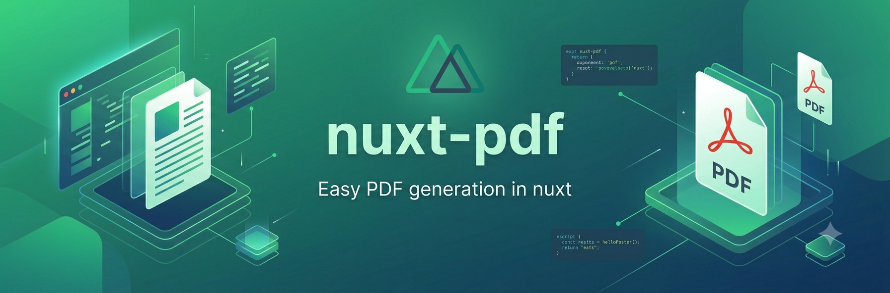

<p align="center">
  
</p>

# @maistik/nuxt-pdf

[](https://www.npmjs.com/package/@maistik/nuxt-pdf)
[](https://www.npmjs.com/package/@maistik/nuxt-pdf)
[](./LICENSE)
[](https://nuxt.com)

A powerful Nuxt 3 & 4 module for **server-side PDF generation** using [Handlebars](https://handlebarsjs.com/) templates. Generate beautiful, data-driven PDFs with support for multiple rendering providers (Gotenberg, Browserless, Puppeteer) and built-in internationalization.

Everything runs server-side in Nitro/Node — no PDF code is shipped to the browser.

---

## Table of Contents

- [Features](#features)
- [Requirements](#requirements)
- [Installation](#installation)
- [Quick Start](#quick-start)
- [Project Structure](#project-structure)
- [Configuration Reference](#configuration-reference)
- [Providers](#providers)
- [Internationalization (i18n)](#internationalization-i18n)
- [Built-in Helpers](#built-in-helpers)
- [Custom Helpers](#custom-helpers)
- [Partials](#partials)
- [Automatic Data Enrichment](#automatic-data-enrichment)
- [Composable API — `usePdf()`](#composable-api--usepdf)
- [Server API — `POST /api/pdf`](#server-api--post-apipdf)
- [PDF Options](#pdf-options)
- [Development](#development)
- [Troubleshooting](#troubleshooting)
- [License](#license)

---

## Features

- 🎨 **Handlebars templates** — lightweight templating, no Vue/SSR overhead
- 🌍 **Internationalization** — built-in i18n with the `{{t}}` helper and nested keys
- 🔄 **Provider-agnostic** — Gotenberg, Browserless, or Puppeteer, switchable via config
- 🎯 **SSR-safe** — rendering happens entirely server-side in Nitro/Node
- 🧩 **Composable API** — simple `usePdf()` for `generate()` and `download()`
- 🧮 **Rich helper library** — currency, dates, numbers, math, string and comparison helpers
- 🛠️ **Custom helpers** — define your own helpers in `nuxt.config` (works in production)
- 📐 **Print-aware** — `@page`, page breaks, and `@media print` styling
- 🎪 **Playground** — demo app with Invoice & Sales Report templates in 3 languages

---

## Requirements

| Requirement | Version |
| ----------- | ------- |
| Nuxt        | `3.x` or `4.x` |
| Node.js     | `18`, `20`, or `22` (CI-tested; `22` recommended) |
| Handlebars  | `^4.7` (peer-installed alongside the module) |

A Chromium/Chrome runtime is required **only** for the `puppeteer` provider. The
`gotenberg` and `browserless` providers run the browser remotely.

---

## Installation

```bash
# pnpm
pnpm add @maistik/nuxt-pdf handlebars

# npm
npm install @maistik/nuxt-pdf handlebars

# yarn
yarn add @maistik/nuxt-pdf handlebars
```

> `handlebars` is a peer dependency so your app and the module share a single
> instance. `puppeteer` ships as a dependency and is only loaded at runtime when
> the `puppeteer` provider is selected.

---

## Quick Start

### 1. Register the module

```ts
// nuxt.config.ts
export default defineNuxtConfig({
  modules: ['@maistik/nuxt-pdf'],
  pdf: {
    provider: 'puppeteer', // 'gotenberg' | 'browserless' | 'puppeteer'
    components: ['pdf'], // where your .hbs templates live
    sharedComponents: ['pdf/partials'], // where your .hbs partials live
    enableI18n: true,
    defaultLocale: 'en',
    availableLocales: ['en', 'es'],
    i18nMessages: {
      en: { invoice: { title: 'Invoice', total: 'Total' } },
      es: { invoice: { title: 'Factura', total: 'Total' } },
    },
  },
})
```

### 2. Create a template

Create `pdf/Invoice.hbs` in your project root:

```handlebars
<style>
  @page { size: A4; margin: 20mm; }
  body { font-family: Arial, sans-serif; color: #333; }
  .header { text-align: center; margin-bottom: 30px; }
  .total { font-weight: bold; font-size: 18px; }
</style>

<div class="header">
  <h1>{{t "invoice.title"}}</h1>
  <p>Invoice #{{invoiceNumber}}</p>
</div>

<table>
  {{#each items}}
  <tr>
    <td>{{this.description}}</td>
    <td>{{formatCurrency this.price}}</td>
  </tr>
  {{/each}}
</table>

<div class="total">
  {{t "invoice.total"}}: {{formatCurrency total}}
</div>
```

### 3. Generate the PDF

```vue
<script setup lang="ts">
const { generate, download } = usePdf()

async function makeInvoice() {
  const data = {
    invoiceNumber: 'INV-001',
    items: [{ description: 'Service', price: 100 }],
    total: 100,
  }

  // Get a Blob (preview, upload, attach to email, ...)
  const blob = await generate('Invoice', data, { format: 'A4' }, 'en')

  // Or trigger a browser download directly
  await download('Invoice', data, { format: 'A4' }, 'invoice.pdf', 'en')
}
</script>
```

---

## Project Structure

Template directories are resolved relative to your **project root** (not `srcDir`),
so the same layout works for both Nuxt 3 and Nuxt 4 (which moves `srcDir` to `app/`):

```
your-project/
├─ nuxt.config.ts
├─ pdf/                      # `components` → templates
│  ├─ Invoice.hbs           # referenced as "Invoice"
│  ├─ SalesReport.hbs       # referenced as "SalesReport"
│  └─ partials/             # `sharedComponents` → partials
│     ├─ header.hbs         # used as {{> header}}
│     └─ footer.hbs         # used as {{> footer}}
└─ ...
```

- Templates are discovered **recursively** by their `.hbs` extension.
- A template's **name is its filename without extension** (`Invoice.hbs` → `"Invoice"`).
- Partials are registered under their filename and used with `{{> name}}`.

---

## Configuration Reference

All options live under the `pdf` key in `nuxt.config.ts`.

| Option | Type | Default | Description |
| ------ | ---- | ------- | ----------- |
| `provider` | `'gotenberg' \| 'browserless' \| 'puppeteer'` | `'gotenberg'` | Active rendering backend. |
| `components` | `string[]` | `['pdf']` | Directories (relative to project root) scanned for `.hbs` templates. |
| `sharedComponents` | `string[]` | `['pdf/partials']` | Directories scanned for `.hbs` partials. |
| `enableI18n` | `boolean` | `true` | Enables the `{{t}}` helper and locale message lookup. |
| `defaultLocale` | `string` | `'en'` | Locale used when none is passed to `generate()`. |
| `availableLocales` | `string[]` | `['en']` | Locales exposed to the client via `getAvailableLocales()`. |
| `i18nMessages` | `Record<string, Record<string, unknown>>` | `{}` | Nested translation messages keyed by locale. |
| `providers` | `object` | see below | Per-provider connection settings. |
| `defaultOptions` | `PdfOptions` | see below | Default render options merged with per-call options. |
| `customHelpers` | `Record<string, Function>` | `{}` | Extra Handlebars helpers (see [Custom Helpers](#custom-helpers)). |

<details>
<summary><strong>Default <code>providers</code> and <code>defaultOptions</code></strong></summary>

```ts
providers: {
  gotenberg: { url: 'http://localhost:3000' },
  browserless: { url: 'https://chrome.browserless.io', apiKey: '' },
  puppeteer: {
    launchOptions: {
      headless: true,
      args: ['--no-sandbox', '--disable-setuid-sandbox'],
    },
  },
},
defaultOptions: {
  format: 'A4',
  margin: { top: 20, bottom: 20, left: 20, right: 20 }, // millimetres
  landscape: false,
  printBackground: true,
  pageBreak: {
    before: ['always'],
    after: ['always'],
    avoid: ['.no-break'],
  },
},
```

> **Margins are expressed in millimetres.** The Gotenberg provider converts them
> to inches automatically.

</details>

---

## Providers

Switch backends by changing `provider` and supplying the matching `providers` entry.

### Puppeteer (local / on-prem)

Best for development and single-server deployments. Uses the Chromium bundled with
Puppeteer by default; point it at a system Chrome with `executablePath`.

```ts
pdf: {
  provider: 'puppeteer',
  providers: {
    puppeteer: {
      launchOptions: {
        headless: true,
        args: ['--no-sandbox', '--disable-setuid-sandbox'],
        // Optional — defaults to Puppeteer's bundled Chromium:
        // executablePath: process.env.CHROME_PATH,
      },
    },
  },
}
```

> `launchOptions` is passed straight to `puppeteer.launch()`. `--no-sandbox` is
> commonly required inside containers, but only disable the sandbox in trusted
> environments.

### Gotenberg (Docker)

Ideal for containerized stacks. Run Gotenberg alongside your app:

```bash
docker run --rm -p 3000:3000 gotenberg/gotenberg:8
```

```ts
pdf: {
  provider: 'gotenberg',
  providers: {
    gotenberg: { url: 'http://gotenberg:3000' },
  },
}
```

### Browserless (cloud / self-hosted)

Great for serverless deployments where you don't manage a browser:

```ts
pdf: {
  provider: 'browserless',
  providers: {
    browserless: {
      url: 'https://chrome.browserless.io',
      apiKey: process.env.BROWSERLESS_API_KEY,
    },
  },
}
```

| Provider | Where Chrome runs | Best for |
| -------- | ----------------- | -------- |
| `puppeteer` | In-process, local | Dev, on-prem, full control |
| `gotenberg` | Separate container | Docker / Kubernetes |
| `browserless` | Remote service | Serverless / managed |

---

## Internationalization (i18n)

Provide nested messages per locale and look them up with the `{{t}}` helper using
dot-separated keys:

```ts
i18nMessages: {
  en: { invoice: { title: 'Invoice', total: 'Total' } },
  fr: { invoice: { title: 'Facture', total: 'Total' } },
}
```

```handlebars
<h1>{{t "invoice.title"}}</h1>
```

- The locale is chosen per call (`generate(..., locale)`), falling back to
  `defaultLocale`.
- Missing keys render the **key itself** (e.g. `invoice.unknown`) so gaps are visible.
- The same locale drives `Intl`-based helpers (`formatCurrency`, `formatDate`,
  `formatNumber`).

---

## Built-in Helpers

These helpers are always registered, regardless of configuration.

### Internationalization
```handlebars
{{t "invoice.title"}}              <!-- localized text (or the key if missing) -->
```

### Currency
```handlebars
{{formatCurrency 1234.56}}         <!-- $1,234.56 (USD by default) -->
{{formatCurrency 1234.56 "EUR"}}   <!-- €1,234.56 -->
{{formatCurrency amount currency="GBP"}}
```

### Dates
```handlebars
{{formatDate date}}                <!-- short style, e.g. 1/15/24 -->
{{formatDate date "full"}}         <!-- full style, e.g. Monday, January 15, 2024 -->
{{formatDate date format="long"}}  <!-- styles: full | long | medium | short -->
```

### Numbers
```handlebars
{{formatNumber 1234.56}}                 <!-- 1,234.56 -->
{{formatNumber 0.15 style="percent"}}    <!-- 15% -->
{{formatNumber n minimumFractionDigits=2}}
```

> `formatNumber` forwards any hash arguments to
> [`Intl.NumberFormat`](https://developer.mozilla.org/docs/Web/JavaScript/Reference/Global_Objects/Intl/NumberFormat).

### Math
```handlebars
{{add 10 5}}            <!-- 15 -->
{{subtract 10 5}}       <!-- 5 -->
{{multiply 10 5}}       <!-- 50 -->
{{divide 10 5}}         <!-- 2  (returns 0 when dividing by 0) -->
{{percentage 25 100}}   <!-- 25.00% -->
{{lineTotal qty price}} <!-- qty * price, fixed to 2 decimals -->
```

### Strings
```handlebars
{{upper "hello world"}}          <!-- HELLO WORLD -->
{{lower "HELLO WORLD"}}          <!-- hello world -->
{{capitalize "hello world"}}     <!-- Hello world -->
{{truncate "Long text here" 10}} <!-- Long text ... -->
```

### Comparison

Work both inline (returning a boolean) and as block helpers:

```handlebars
{{#if (eq status "paid")}}Paid{{/if}}
{{#eq a b}}equal{{else}}different{{/eq}}
{{#ne a b}}not equal{{/ne}}
{{#gt total 1000}}High value{{/gt}}
```

---

## Custom Helpers

Define your own Handlebars helpers in `nuxt.config.ts`. They are compiled into a
server-side module at build time, so **they work in development *and* production**:

```ts
pdf: {
  customHelpers: {
    // Simple value transformation
    shout: (value: string) => `${String(value ?? '').toUpperCase()}!`,

    // Repeat a string
    repeat: (str: string, times: number) => String(str).repeat(times || 1),

    // Block helper with conditional logic
    ifEquals(this: unknown, a: unknown, b: unknown, options: any) {
      return a === b ? options.fn(this) : options.inverse(this)
    },
  },
}
```

```handlebars
{{shout "hello"}}                 <!-- HELLO! -->
{{repeat "★" 5}}                  <!-- ★★★★★ -->
{{#ifEquals status "active"}}Active{{else}}Inactive{{/ifEquals}}
```

> ⚠️ **Custom helpers must be self-contained.** Only each function's *source* is
> serialized into the runtime module — a helper cannot reference variables, imports,
> or values from the surrounding `nuxt.config.ts` scope. Keep all logic inside the
> function body.

---

## Partials

Create reusable fragments in any `sharedComponents` directory:

```handlebars
<!-- pdf/partials/header.hbs -->
<div class="header">
  <h1>{{title}}</h1>
  <p>{{subtitle}}</p>
</div>
```

Use them in templates, passing parameters as needed:

```handlebars
{{> header title="My Document" subtitle="Generated Report"}}
```

---

## Automatic Data Enrichment

For convenience, the module derives some fields based on the **template name**:

**Invoice templates** (name contains `invoice`) receive, when `items[]` is present:

- `subtotal` — sum of `quantity × price` across items
- `tax` — `subtotal × (taxRate ?? 0.1)`
- `total` — `subtotal + tax`
- `dueDate` — `issueDate + paymentTerms` days (when both are provided)

**Sales report templates** (name contains `salesreport`) receive, when `salesData[]`
is present:

- `quarters` — quarterly totals derived from each entry's `date`/`amount`
- `rating` — performance rating from total sales (`Excellent` / `Good` / `Average` /
  `Needs Improvement`)

> Provide these values yourself if you don't want them computed — your data is
> spread first, then enriched.

---

## Composable API — `usePdf()`

```ts
const {
  generate,            // (template, data, options?, locale?) => Promise<Blob>
  download,            // (template, data, options?, filename?, locale?) => Promise<void>
  getAvailableLocales, // () => string[]
  getDefaultLocale,    // () => string
} = usePdf()
```

| Method | Signature | Notes |
| ------ | --------- | ----- |
| `generate` | `(template, data, options?, locale?) => Promise<Blob>` | Returns an `application/pdf` `Blob`. |
| `download` | `(template, data, options?, filename?, locale?) => Promise<void>` | Browser-only — creates and clicks a download link. |
| `getAvailableLocales` | `() => string[]` | Reads `availableLocales` from public runtime config. |
| `getDefaultLocale` | `() => string` | Reads `defaultLocale` from public runtime config. |

When no `locale` is passed, `defaultLocale` is used.

---

## Server API — `POST /api/pdf`

The composable calls a server route that you can also hit directly (e.g. from other
services). The module registers it automatically.

**Request**

```http
POST /api/pdf
Content-Type: application/json
```

```json
{
  "template": "Invoice",
  "ctx": {
    "data": { "invoiceNumber": "INV-001", "items": [] },
    "options": { "format": "A4" },
    "locale": "en"
  }
}
```

**Response** — binary `application/pdf` body.

**Status codes**

| Code | Meaning |
| ---- | ------- |
| `200` | PDF generated; body is the PDF bytes. |
| `400` | Missing/invalid `template` or `ctx`. |
| `404` | `template` does not match any discovered `.hbs` file. |
| `500` | Rendering or provider failure (details are logged server-side, not leaked). |

---

## PDF Options

Passed as the `options` argument to `generate()`/`download()` and merged over
`defaultOptions`:

```ts
interface PdfOptions {
  format?: 'A4' | 'Letter' | 'Legal'
  margin?: {
    top?: number    // millimetres
    bottom?: number
    left?: number
    right?: number
  }
  landscape?: boolean
  printBackground?: boolean
  pageBreak?: {
    before?: string[]
    after?: string[]
    avoid?: string[]
  }
}
```

### Print-aware CSS

Templates are plain HTML/CSS, so you can use print rules directly:

```css
@page { size: A4; margin: 20mm; }

.page-break { page-break-before: always; }

@media print {
  .no-break { page-break-inside: avoid; }
}
```

---

## Development

This repository uses **pnpm**.

```bash
pnpm install          # install dependencies
pnpm dev              # run the playground with HMR
pnpm dev:build        # build the playground (Nitro)
pnpm build            # build the module
pnpm lint             # eslint
pnpm test:unit        # vitest unit tests
pnpm test:e2e         # playwright end-to-end tests
pnpm test             # unit + e2e
```

The `playground/` app demonstrates Invoice and Sales Report templates in English,
Spanish, and French, plus a custom helper and provider configuration examples.

---

## Troubleshooting

**Template `"X"` not found (404).** The `template` must match a `.hbs` filename
(without extension) inside one of your `components` directories. Remember the lookup
is by filename, not path.

**Puppeteer can't find Chrome.** Either rely on Puppeteer's bundled Chromium (omit
`executablePath`) or set `CHROME_PATH`/`executablePath` to a valid Chrome binary. In
containers you'll usually need `args: ['--no-sandbox']`.

**Gotenberg/Browserless errors.** Confirm the `url` is reachable from the server and,
for Browserless, that `apiKey` is set.

**My custom helper does nothing.** Ensure it's a function and fully self-contained —
it cannot close over values defined elsewhere in `nuxt.config.ts` (only the function
source is serialized).

---

## License

[MIT](./LICENSE)

---

## Support

- 📖 [Documentation](https://github.com/Maistik-Studio/nuxt-pdf)
- 🐛 [Issue Tracker](https://github.com/Maistik-Studio/nuxt-pdf/issues)
- 💬 [Discussions](https://github.com/Maistik-Studio/nuxt-pdf/discussions)
